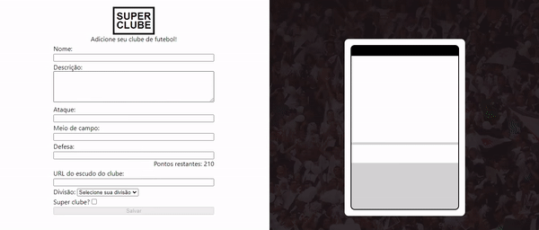

# Tryunfo (Super Clube v0.1)

Projeto feito enquanto estudava na [Trybe](https://www.betrybe.com/), utilizando React, Class Components, Javascript e SaSS no módulo de front-end. Entregue com 100% dos requisitos.

Ao utilizar essa aplicação uma pessoa usuária é capaz de:

- Criar um baralho, com o tema livre;

- Adicionar e remover uma carta do baralho;

- Visualizar todas as cartas que foram adicionadas ao baralho;

## Direitos autorais

Esse projeto foi desenvolvido por mim ([Matheus Gomes](https://www.linkedin.com/in/matheusgb/)) apenas visando o aprendizado.

